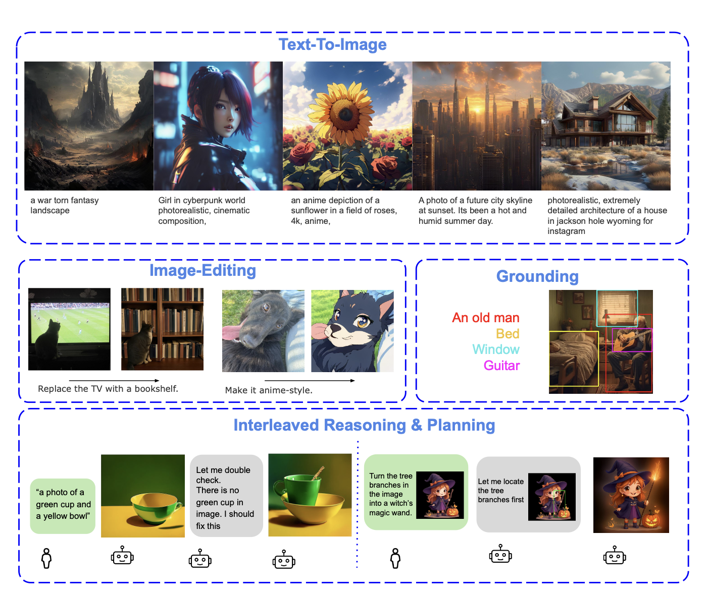

# Lavida-O: Efficient Scaling of Unified Masked Diffusion Model for Multi-modal Understanding and Generation.

[[Paper]](https://arxiv.org/abs/2509.19244) [[Project Site]](https://homepage.jackli.org/projects/lavida_o/index.html) [[Huggingface]](https://huggingface.co/jacklishufan/LaViDa-O-v1.0/tree/main)


### Installation

```
conda create --name lavida python=3.13
conda activate lavida
pip install -e .[lavida]
pip install wheel
MAX_JOBS=32 pip install flash-attn==2.7.4.post1 --no-build-isolation
pip install jupyter notebook
pip install -U huggingface_hub[hf_xet] --force-reinstall
```

### Download Checkpoint

Please download checkpoints from [[Huggingface]](https://huggingface.co/jacklishufan/LaViDa-O-v1.0/tree/main). 

You can use the following script to download the checkpoints

```
python download_checkpoint.py
```


## Inference
Please see [this notebook](Demo.ipynb) for inference examples of image understanding, generation and editing tasks.


## Evaluation

### Text-to-Image-Generation

We provide evaluation code for GenEval and DPG benchamrks in the folder `eval_img`. To reproduce results, run the following command:

```
bash eval_img/geneval.sh
bash eval_img/dpg.sh
```

For GenEval, please install [mmdetection](https://github.com/open-mmlab/mmdetection) following official instructions. For DPG, please install [modelscope](https://github.com/modelscope/modelscope)


### Image-Edit Bench

```
bash eval_img/imgedit-eval.sh
```

### RefCOCO Grounding

```
bash /sensei-fs-3/users/shufanl/lavida-o-public/eval/run_grounding.sh
```

### Image Understanding Tasks 

Frist, we need to install the evaluation library
```
cd eval
pip install -e .
pip install levenshtein
```

Then, we run
```
bash /sensei-fs-3/users/shufanl/lavida-o-public/eval/run_grounding.sh
```

### LICENSE

Both the model and code are licensed with Adobe Research License, which is included here [[License.pdf]](License.pdf).
